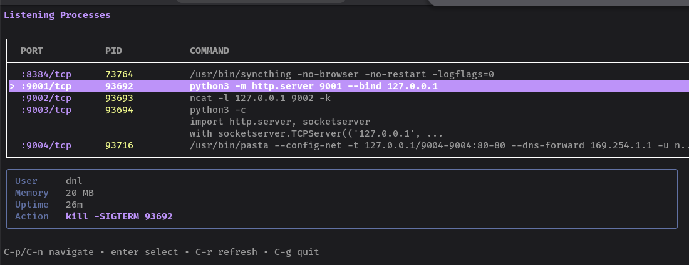

# zap

Have to many dev servers or containers running, now the ports are conflicting and you have no clue where you actually started it? Always forget the syntax of 'netstat' and too lazy to pipe that into `kill`?

Then this is for you, easily check for processes by port number and kill them. Detects containers (Podman/Docker) and systemd services for proper shutdown.



## Install

```bash
go install github.com/dnl/zap/cmd/zap@latest
```

Or build from source:

```bash
go build -o zap ./cmd/zap/
```

## Usage

```bash
# Interactive TUI showing all listening ports
zap

# Target a specific port
zap :3000

# Port range
zap :8080-8090

# Specific interface
zap localhost:5432

# Force kill (SIGKILL)
zap :3000 --force

# Dry run (non-interactive, shows what would be killed)
zap :3000 --dry-run
```


## Kill strategies

zap automatically picks the best way to stop a process:

1. **Container** — `podman stop` / `docker stop` for containerized processes
2. **Systemd** — `systemctl stop` for systemd-managed services
3. **Signal** — `SIGTERM` (or `SIGKILL` with `--force`) for bare processes

## Flags

| Flag | Short | Description |
|------|-------|-------------|
| `--force` | `-f` | Use SIGKILL / container kill instead of graceful stop |
| `--dry-run` | `-n` | Show what would be killed (non-interactive) |
| `--version` | `-v` | Print version |
| `--help` | `-h` | Show help |
